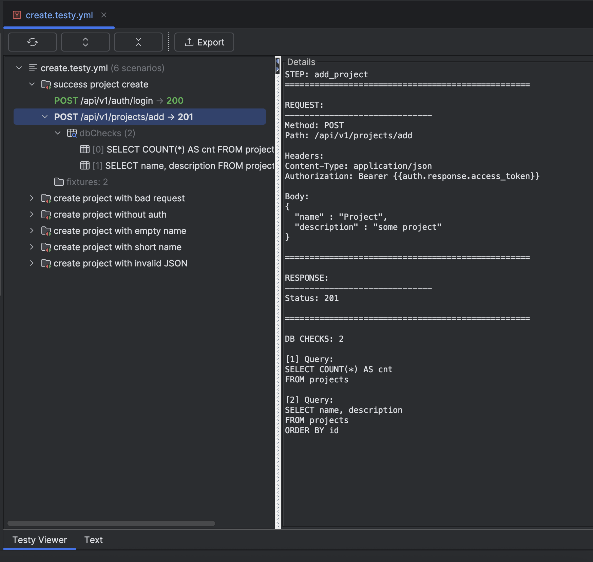

# Testy GoLand Plugin

Visual viewer for Testy YAML test scenarios in GoLand IDE. Provides structured tree view, schema validation, and color-coded HTTP, gRPC methods and status codes.

## Features

- **Structured Tree View**: Swagger-like tree view displaying test scenarios, steps, fixtures, mocks, and validation errors
- **Schema Validation**: Real-time validation against JSON Schema with error highlighting
- **Color Coding**: 
  - HTTP methods: GET (blue), POST (green), PUT (olive), PATCH (purple), DELETE (red)
  - Status codes: 2xx (green), 4xx (orange), 5xx (red)
- **Navigation**: Double-click on any node to navigate to the corresponding location in the YAML file
- **Live Updates**: Automatically refreshes when the file is modified (with debounce)
- **Context Menu**: Right-click for additional actions (Reveal in Editor, Copy JSON Pointer, Expand/Collapse)
- **Toolbar**: Quick access to Refresh, Expand All, and Collapse All actions



## Supported Format

The plugin supports `.testy.yml` and `.testy.yaml` files following the Testy test framework specification:

- Top-level array of test scenarios
- Each scenario contains:
  - `name` (required): Scenario name
  - `fixtures` (optional): List of fixture file names
  - `mockServers` (optional): HTTP mock server configurations
  - `mockCalls` (optional): Expected mock server call verifications
  - `steps` (required): Array of test steps
    - Each step contains:
      - `name` (required): Step name
      - `request` (required): HTTP request configuration (method, path, headers, body)
      - `response` (required): Expected response (status, headers, json)
      - `dbChecks` (optional): Database assertions

## Usage

1. Install **Testy Tests Viewer** from [JetBrains Marketplace](https://plugins.jetbrains.com/)
   *(or manually via “Install Plugin from Disk…” and select `testy-goland-plugin.zip`)*
2. Open a `.testy.yml` or `.testy.yaml` file in GoLand
3. The Testy Viewer panel will automatically open alongside the editor
4. Use the tree view to navigate through scenarios and steps
5. Double-click any node to jump to its location in the YAML file
6. Validation errors are displayed in red with navigation support

## Known Limitations

- Large files may experience performance issues (validation and parsing are optimized but not unlimited)
- Some complex YAML structures may not map perfectly to JSON Pointer paths
- PSI offset mapping for validation errors is best-effort and may not always be precise

## Development

### Building

```bash
./gradlew buildPlugin
```

### Running Tests

```bash
./gradlew unitTest
```

### Running in IDE

```bash
./gradlew runIde
```

## License

See LICENSE file for details.
